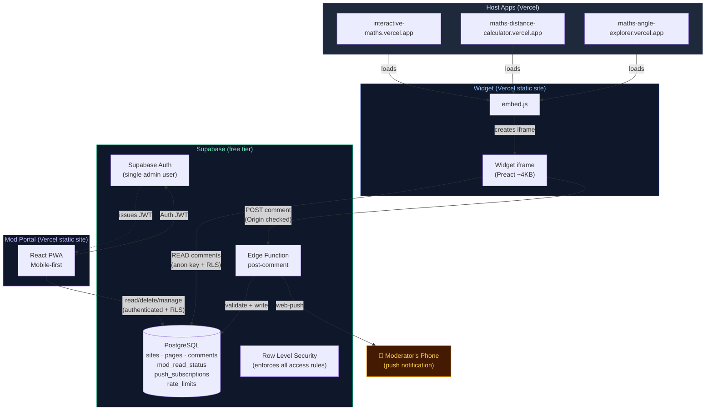
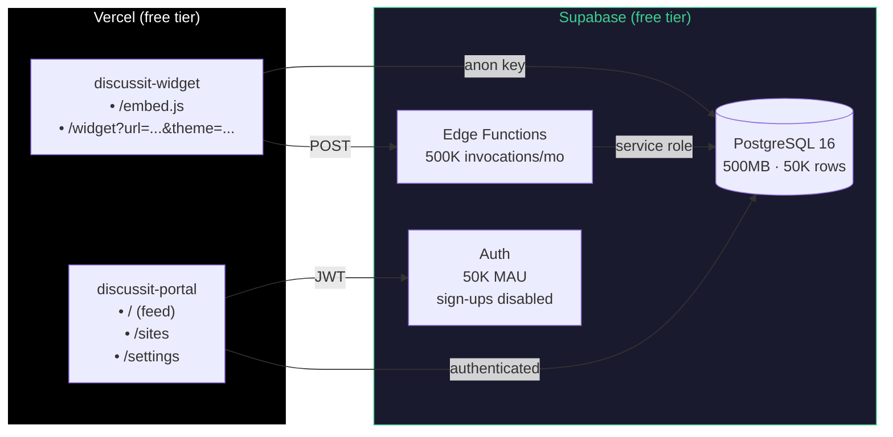
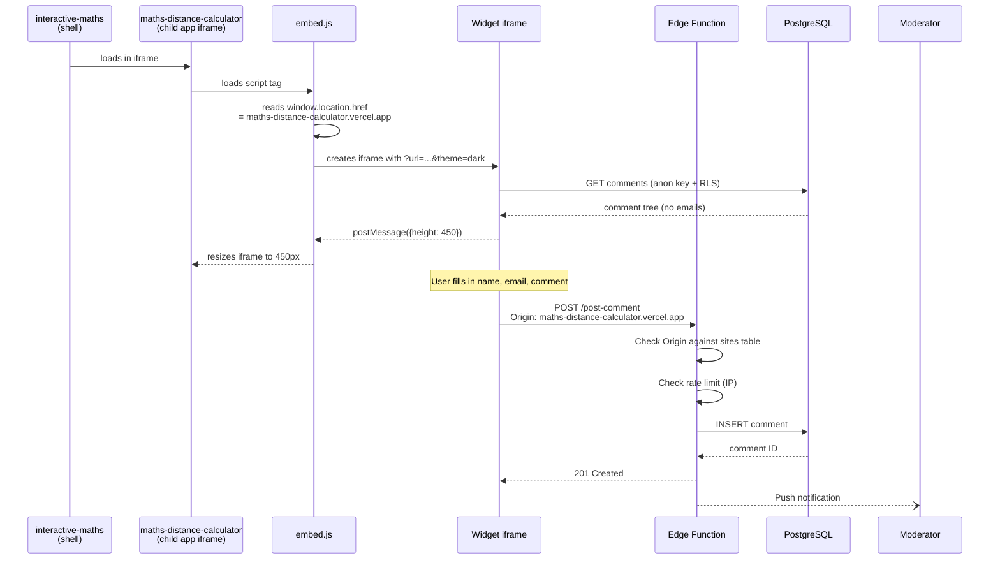
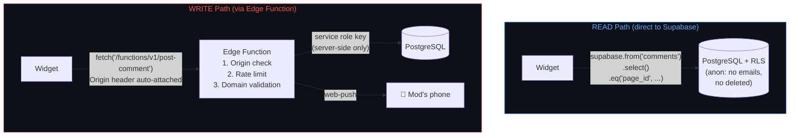

# System Architecture

## High-Level Overview

```mermaid
flowchart TB
    subgraph HostApps["Host Apps (Vercel)"]
        A1["interactive-maths.vercel.app"]
        A2["maths-distance-calculator.vercel.app"]
        A3["maths-angle-explorer.vercel.app"]
    end

    subgraph Widget["Widget (Vercel static site)"]
        E["embed.js"]
        W["Widget iframe\n(Preact ~4KB)"]
    end

    subgraph Supabase["Supabase (free tier)"]
        PG[("PostgreSQL\nsites · pages · comments\nmod_read_status\npush_subscriptions\nrate_limits")]
        EF["Edge Function\npost-comment"]
        RLS["Row Level Security\n(enforces all access rules)"]
        AUTH["Supabase Auth\n(single admin user)"]
    end

    subgraph Portal["Mod Portal (Vercel static site)"]
        MP["React PWA\nMobile-first"]
    end

    PHONE["📱 Moderator's Phone\n(push notification)"]

    A1 & A2 & A3 -- "loads" --> E
    E -- "creates iframe" --> W
    W -- "READ comments\n(anon key + RLS)" --> PG
    W -- "POST comment\n(Origin checked)" --> EF
    EF -- "validate + write" --> PG
    EF -- "web-push" --> PHONE
    MP -- "Auth JWT" --> AUTH
    MP -- "read/delete/manage\n(authenticated + RLS)" --> PG
    AUTH -. "issues JWT" .-> MP

    style HostApps fill:#1e293b,stroke:#334155,color:#e2e8f0
    style Widget fill:#0f172a,stroke:#1e40af,color:#93c5fd
    style Supabase fill:#0f172a,stroke:#059669,color:#6ee7b7
    style Portal fill:#0f172a,stroke:#7c3aed,color:#c4b5fd
    style PHONE fill:#451a03,stroke:#f59e0b,color:#fcd34d
```

## Deployment Topology

```mermaid
flowchart LR
    subgraph Vercel["Vercel (free tier)"]
        direction TB
        VW["discussit-widget\n• /embed.js\n• /widget?url=...&theme=..."]
        VP["discussit-portal\n• / (feed)\n• /sites\n• /settings"]
    end

    subgraph SupabaseCloud["Supabase (free tier)"]
        direction TB
        DB[("PostgreSQL 16\n500MB · 50K rows")]
        FN["Edge Functions\n500K invocations/mo"]
        SA["Auth\n50K MAU\nsign-ups disabled"]
    end

    VW -- "anon key" --> DB
    VW -- "POST" --> FN
    FN -- "service role" --> DB
    VP -- "JWT" --> SA
    VP -- "authenticated" --> DB

    style Vercel fill:#000,stroke:#fff,color:#fff
    style SupabaseCloud fill:#1a1a2e,stroke:#3ecf8e,color:#3ecf8e
```

## Iframe Embedding Flow

```mermaid
sequenceDiagram
    participant Shell as interactive-maths<br/>(shell)
    participant Child as maths-distance-calculator<br/>(child app iframe)
    participant Embed as embed.js
    participant WidgetFrame as Widget iframe
    participant EF as Edge Function
    participant DB as PostgreSQL

    Shell->>Child: loads in iframe
    Child->>Embed: loads script tag
    Embed->>Embed: reads window.location.href<br/>= maths-distance-calculator.vercel.app
    Embed->>WidgetFrame: creates iframe with ?url=...&theme=dark
    WidgetFrame->>DB: GET comments (anon key + RLS)
    DB-->>WidgetFrame: comment tree (no emails)
    WidgetFrame-->>Embed: postMessage({height: 450})
    Embed-->>Child: resizes iframe to 450px

    Note over WidgetFrame: User fills in name, email, comment
    WidgetFrame->>EF: POST /post-comment<br/>Origin: maths-distance-calculator.vercel.app
    EF->>EF: Check Origin against sites table
    EF->>EF: Check rate limit (IP)
    EF->>DB: INSERT comment
    DB-->>EF: comment ID
    EF-->>WidgetFrame: 201 Created
    EF--)Moderator: Push notification
```

## Data Flow: Read vs Write

```mermaid
flowchart TB
    subgraph ReadPath["READ Path (direct to Supabase)"]
        direction LR
        W1["Widget"] -->|"supabase.from('comments')\n.select()\n.eq('page_id', ...)"| DB1[("PostgreSQL + RLS\n(anon: no emails,\nno deleted)")]
    end

    subgraph WritePath["WRITE Path (via Edge Function)"]
        direction LR
        W2["Widget"] -->|"fetch('/functions/v1/post-comment')\nOrigin header auto-attached"| EF2["Edge Function\n1. Origin check\n2. Rate limit\n3. Domain validation"]
        EF2 -->|"service role key\n(server-side only)"| DB2[("PostgreSQL")]
        EF2 -->|"web-push"| PUSH2["📱 Mod's phone"]
    end

    style ReadPath fill:#0d1117,stroke:#1f6feb,color:#58a6ff
    style WritePath fill:#0d1117,stroke:#da3633,color:#f85149
```
