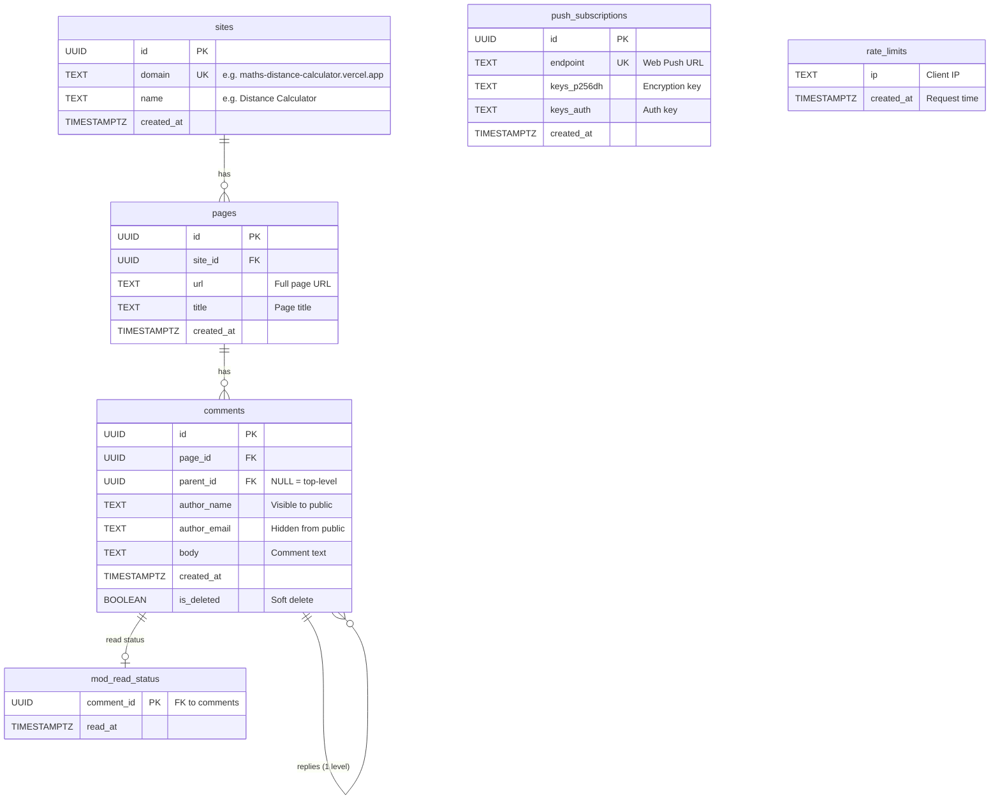
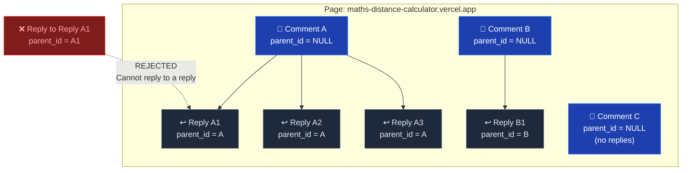
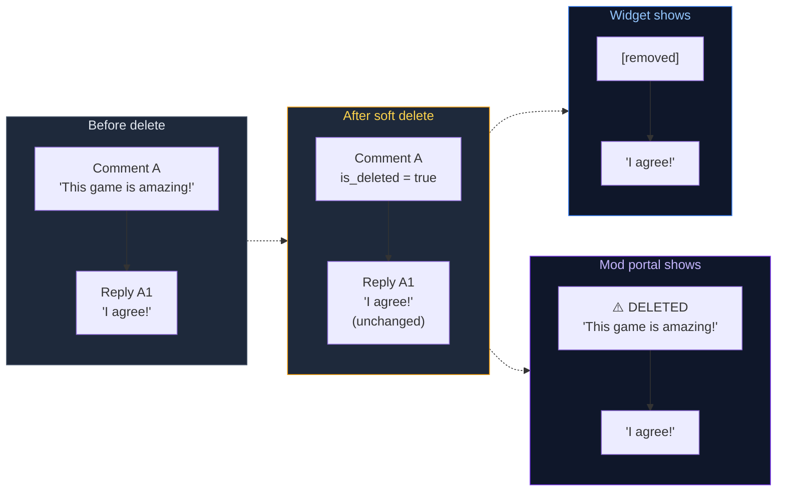
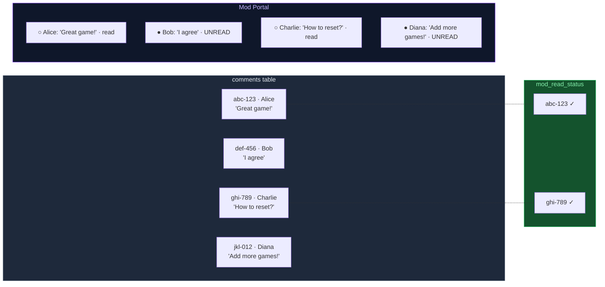

# Data Model

## Entity Relationship Diagram



## Threading Model



## Soft Delete Behavior



## Read/Unread Tracking



## SQL Schema

```sql
CREATE TABLE sites (
  id          UUID PRIMARY KEY DEFAULT gen_random_uuid(),
  domain      TEXT NOT NULL UNIQUE,
  name        TEXT,
  created_at  TIMESTAMPTZ DEFAULT now()
);

CREATE TABLE pages (
  id          UUID PRIMARY KEY DEFAULT gen_random_uuid(),
  site_id     UUID REFERENCES sites(id),
  url         TEXT NOT NULL,
  title       TEXT,
  created_at  TIMESTAMPTZ DEFAULT now(),
  UNIQUE(site_id, url)
);

CREATE TABLE comments (
  id          UUID PRIMARY KEY DEFAULT gen_random_uuid(),
  page_id     UUID REFERENCES pages(id) ON DELETE CASCADE,
  parent_id   UUID REFERENCES comments(id) ON DELETE CASCADE,
  author_name TEXT NOT NULL,
  author_email TEXT NOT NULL,
  body        TEXT NOT NULL,
  created_at  TIMESTAMPTZ DEFAULT now(),
  is_deleted  BOOLEAN DEFAULT false
);

CREATE TABLE mod_read_status (
  comment_id  UUID REFERENCES comments(id) ON DELETE CASCADE,
  read_at     TIMESTAMPTZ DEFAULT now(),
  PRIMARY KEY (comment_id)
);

CREATE TABLE push_subscriptions (
  id          UUID PRIMARY KEY DEFAULT gen_random_uuid(),
  endpoint    TEXT NOT NULL UNIQUE,
  keys_p256dh TEXT NOT NULL,
  keys_auth   TEXT NOT NULL,
  created_at  TIMESTAMPTZ DEFAULT now()
);

CREATE TABLE rate_limits (
  ip          TEXT NOT NULL,
  created_at  TIMESTAMPTZ DEFAULT now()
);

CREATE INDEX idx_comments_page ON comments(page_id, created_at);
CREATE INDEX idx_comments_parent ON comments(parent_id);
CREATE INDEX idx_rate_limits_ip ON rate_limits(ip, created_at);
```
