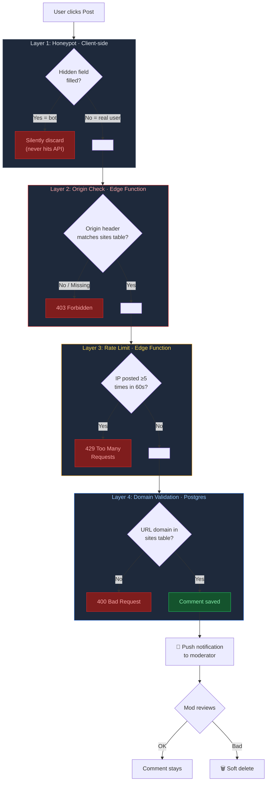
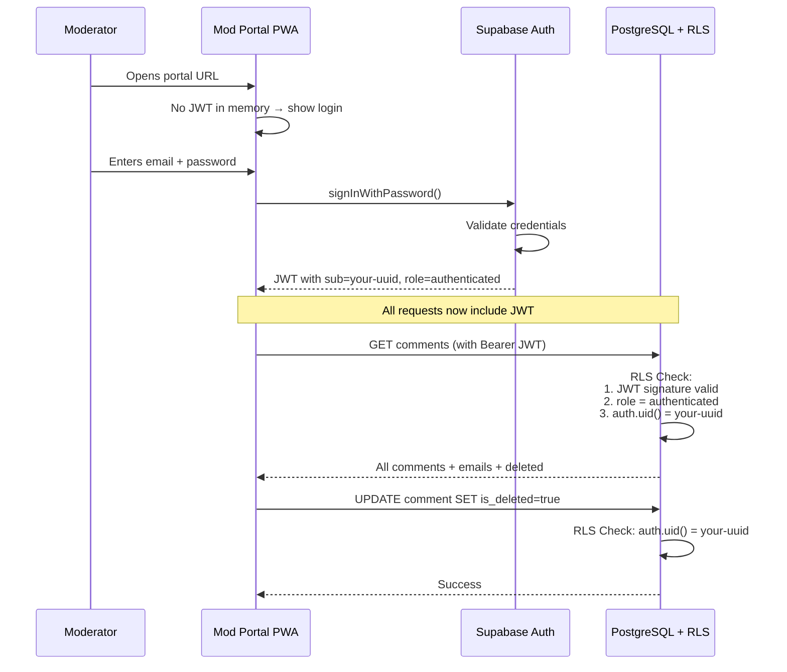
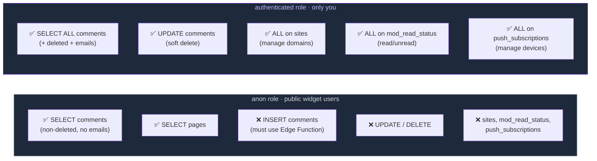
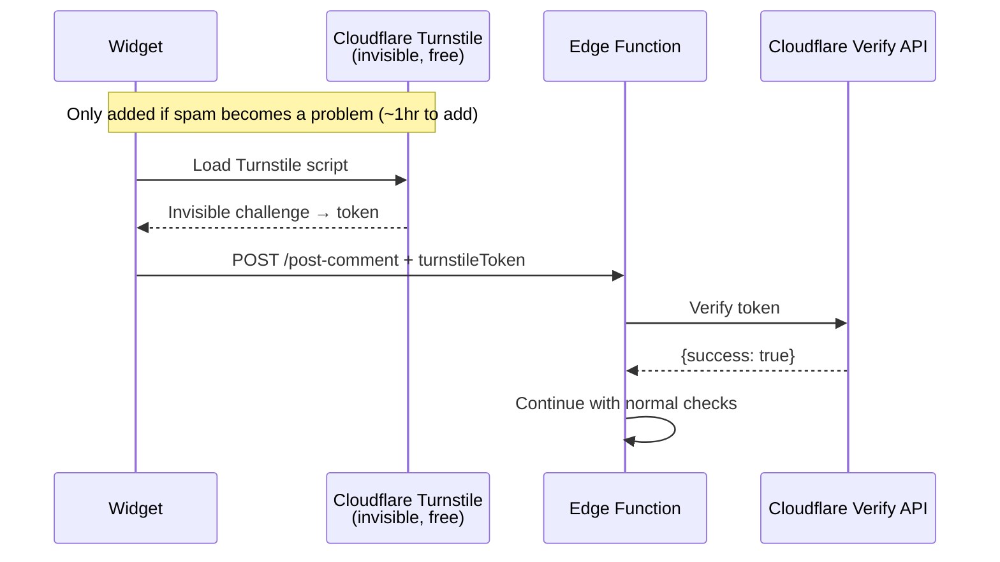

# Security Model

## Security Layers

```mermaid
flowchart TB
    USER["User clicks Post"] --> L1

    subgraph L1["Layer 1: Honeypot · Client-side"]
        HP{"Hidden field\nfilled?"}
        HP -- "Yes = bot" --> DISCARD["Silently discard\n(never hits API)"]
        HP -- "No = real user" --> NEXT1[" "]
    end

    NEXT1 --> L2

    subgraph L2["Layer 2: Origin Check · Edge Function"]
        OC{"Origin header\nmatches sites table?"}
        OC -- "No / Missing" --> REJECT1["403 Forbidden"]
        OC -- "Yes" --> NEXT2[" "]
    end

    NEXT2 --> L3

    subgraph L3["Layer 3: Rate Limit · Edge Function"]
        RL{"IP posted ≥5\ntimes in 60s?"}
        RL -- "Yes" --> REJECT2["429 Too Many\nRequests"]
        RL -- "No" --> NEXT3[" "]
    end

    NEXT3 --> L4

    subgraph L4["Layer 4: Domain Validation · Postgres"]
        DV{"URL domain in\nsites table?"}
        DV -- "No" --> REJECT3["400 Bad Request"]
        DV -- "Yes" --> SAVE["Comment saved"]
    end

    SAVE --> PUSH["🔔 Push notification\nto moderator"]
    PUSH --> MOD{"Mod reviews"}
    MOD -- "OK" --> KEEP["Comment stays"]
    MOD -- "Bad" --> DELETE["🗑️ Soft delete"]

    style L1 fill:#1e293b,stroke:#475569,color:#e2e8f0
    style L2 fill:#1e293b,stroke:#dc2626,color:#fca5a5
    style L3 fill:#1e293b,stroke:#f59e0b,color:#fcd34d
    style L4 fill:#1e293b,stroke:#3b82f6,color:#93c5fd
    style DISCARD fill:#7f1d1d,stroke:#dc2626,color:#fca5a5
    style REJECT1 fill:#7f1d1d,stroke:#dc2626,color:#fca5a5
    style REJECT2 fill:#7f1d1d,stroke:#dc2626,color:#fca5a5
    style REJECT3 fill:#7f1d1d,stroke:#dc2626,color:#fca5a5
    style SAVE fill:#14532d,stroke:#22c55e,color:#86efac
```

## Admin Authentication Flow

```mermaid
sequenceDiagram
    participant Mod as Moderator
    participant Portal as Mod Portal PWA
    participant Auth as Supabase Auth
    participant DB as PostgreSQL + RLS

    Mod->>Portal: Opens portal URL
    Portal->>Portal: No JWT in memory → show login

    Mod->>Portal: Enters email + password
    Portal->>Auth: signInWithPassword()
    Auth->>Auth: Validate credentials
    Auth-->>Portal: JWT with sub=your-uuid, role=authenticated

    Note over Portal,DB: All requests now include JWT

    Portal->>DB: GET comments (with Bearer JWT)
    DB->>DB: RLS Check:<br/>1. JWT signature valid<br/>2. role = authenticated<br/>3. auth.uid() = your-uuid
    DB-->>Portal: All comments + emails + deleted

    Portal->>DB: UPDATE comment SET is_deleted=true
    DB->>DB: RLS Check: auth.uid() = your-uuid
    DB-->>Portal: Success
```

## Role Permissions

```mermaid
flowchart LR
    subgraph Anon["anon role · public widget users"]
        direction TB
        A1["✅ SELECT comments\n(non-deleted, no emails)"]
        A2["✅ SELECT pages"]
        A3["❌ INSERT comments\n(must use Edge Function)"]
        A4["❌ UPDATE / DELETE"]
        A5["❌ sites, mod_read_status,\npush_subscriptions"]
    end

    subgraph Auth["authenticated role · only you"]
        direction TB
        M1["✅ SELECT ALL comments\n(+ deleted + emails)"]
        M2["✅ UPDATE comments\n(soft delete)"]
        M3["✅ ALL on sites\n(manage domains)"]
        M4["✅ ALL on mod_read_status\n(read/unread)"]
        M5["✅ ALL on push_subscriptions\n(manage devices)"]
    end

    style Anon fill:#1e293b,stroke:#6b7280,color:#d1d5db
    style Auth fill:#1e293b,stroke:#7c3aed,color:#c4b5fd
```

## Future: Captcha Layer

```mermaid
sequenceDiagram
    participant W as Widget
    participant CF as Cloudflare Turnstile<br/>(invisible, free)
    participant EF as Edge Function
    participant API as Cloudflare Verify API

    Note over W,CF: Only added if spam becomes a problem (~1hr to add)

    W->>CF: Load Turnstile script
    CF-->>W: Invisible challenge → token

    W->>EF: POST /post-comment + turnstileToken
    EF->>API: Verify token
    API-->>EF: {success: true}
    EF->>EF: Continue with normal checks
```
